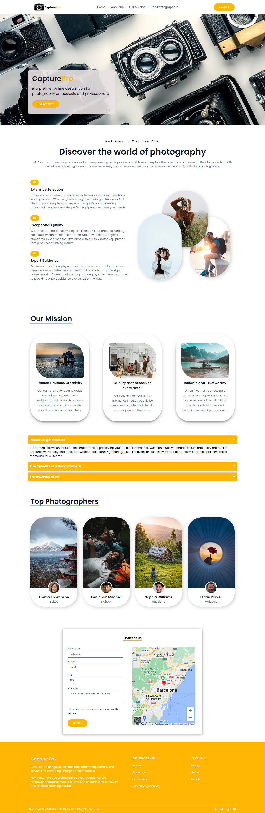

# Capture Pro Project

This project is part of a frontend project developed for a job interview at PlugCore (https://plugcore.com/). The website is fully responsive, ensuring a seamless viewing experience across different devices and screen sizes. Whether you access the website from a desktop computer, laptop, tablet, or smartphone, the content and layout will adapt to provide optimal usability and readability. The goal of the project was to create a responsive website for photography enthusiasts and professionals using HTML, CSS, and JavaScript. 

You can visit the live version of the website at https://capturepro.vercel.app/. Please note that the live version may have additional features or updates compared to the provided code.

Here is a screenshot of how the website looks:


## Table of Contents

- [Project Structure](#project-structure)
- [Dependencies](#dependencies)
- [Usage](#usage)
- [License](#license)

## Project Structure

The project follows a simple structure:

- `index.html`: The main HTML file that represents the structure of the website.
- `styles.css`: The CSS file that defines the styles and layout for the website.
- `app.js`: The JavaScript file that contains the interactive functionality of the website.
- `assets/`: A directory that contains various assets used in the website, such as images and icons.

## Dependencies

The Capture Pro project has the following dependencies:

- [Remix Icon](https://remixicon.com/): A library of free icons used in the project.

Please make sure to include the Remix Icon stylesheet in the `<head>` section of your HTML file:

```html
<link href="https://cdn.jsdelivr.net/npm/remixicon@3.4.0/fonts/remixicon.css" rel="stylesheet">
```

## Usage

To use the Capture Pro project, follow these steps:

1. Clone or download the project files to your local machine.
2. Open the `index.html` file in a web browser.

## License

The Capture Pro project is licensed under the [MIT License](LICENSE).

## Owner

The owner of this project is Manuela Chamoso